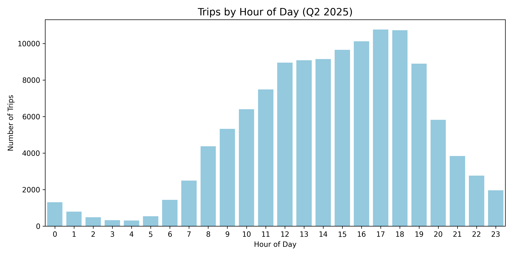
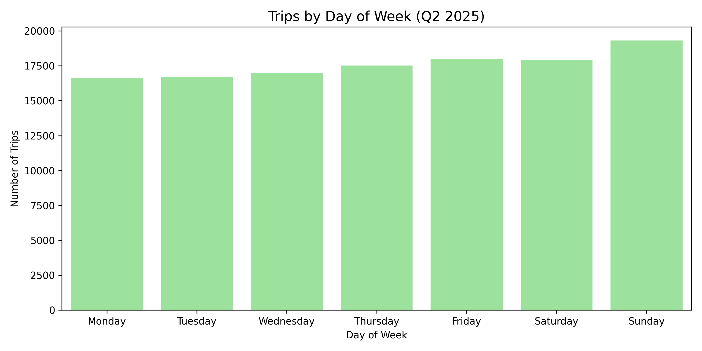
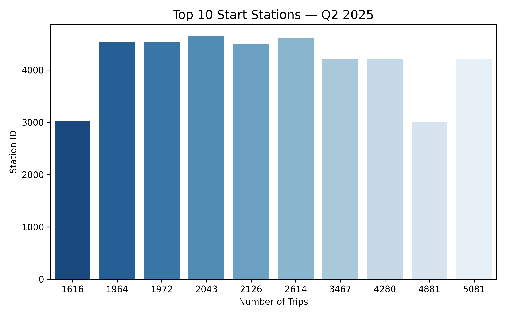
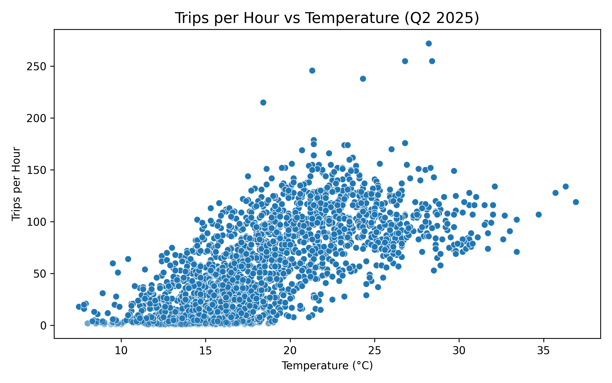
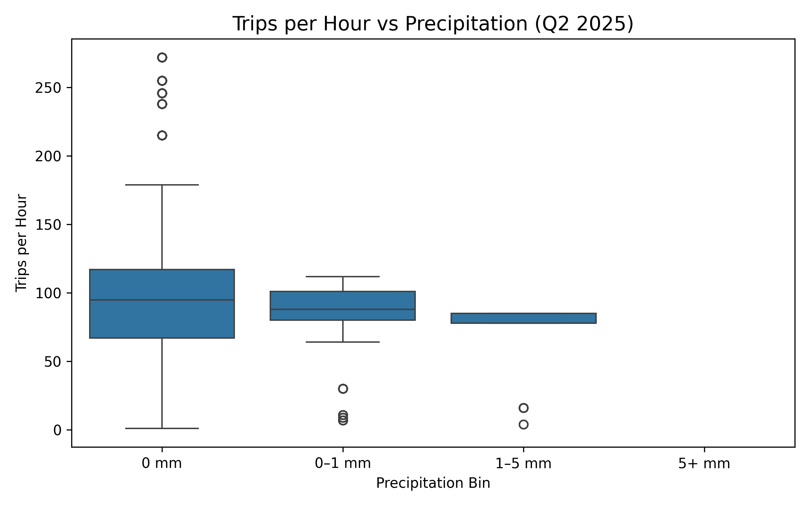

# LA Metro BikeShare Insights - Q2 2025

**Geospatial & Temporal Analysis | Data Cleaning | Weather Impact | Interactive Visuals**

This project analyzes Los Angeles Metro Bike Share data for **Q2 2025 (April–June)** to uncover patterns in ridership, station usage, and the influence of weather conditions.  
By combining **data wrangling**, **exploratory data analysis (EDA)**, **geospatial visualization**, and **weather integration**, we translate raw trip logs into actionable insights for **urban mobility planning**.

---

## 📌 Project Highlights
- **Data Cleaning & Validation**  
  - Parsed 123k+ trip records; fixed schema issues, removed invalid or anomalous trips  
  - Calculated actual durations, Haversine distances, and implied speeds  
  - Flagged anomalies: unrealistic speeds, zero-duration trips, and dock churn
- **Temporal Analysis**  
  - Identified commuter peaks and weekend leisure trends  
  - Quantified seasonality across April, May, and June
- **Spatial Analysis**  
  - Mapped high-traffic start/end stations and top Origin–Destination (OD) routes  
  - Built **interactive Folium & Kepler.gl maps** for top 10 OD pairs
- **Weather Impact Study**  
  - Merged hourly weather data (temperature, precipitation, wind, humidity) with trip logs  
  - Visualized ridership sensitivity to temperature and rainfall
- **Professional Repo Structure**  
  - Modularized code (`notebooks/`, `scripts/`, `data/`, `visuals/`, `reports/`) for reproducibility  
  - Portfolio-ready visuals and interactive dashboards

---

## 📂 Folder Structure

```
la-metro-bikeshare-insights/
│
├── data/
│ ├── raw/ # Original LA Metro trip data
│ ├── processed/ # Cleaned datasets & enriched with weather
│ └── external/ # Weather data & external references
│
├── notebooks/
│ ├── 01_data_cleaning.ipynb
│ ├── 02_exploratory_analysis.ipynb
│ ├── 04_weather_analysis.ipynb
│
├── visuals/
│ ├── plots/ # Static PNG plots
│ └── interactive/ # Folium & Kepler.gl HTML maps
│
├── reports/
│ └── LA_BikeShare_Report.md
│
├── requirements.txt
└── README.md
```

---

## 🔍 Key Insights

### ⏱ Temporal Patterns
  
- **Morning & evening commuter peaks** on weekdays  
- Weekends show flatter patterns with midday leisure spikes  

  
- **Sunday** had the highest ridership in Q2 — likely leisure/tourism influence

---

### 📍 Spatial Patterns
  
- Downtown LA stations dominate the top start points  
- Strong connectivity between transit-adjacent stations

**Interactive Maps**  
- [Folium Map — Top 10 OD Pairs](visuals/interactive/top10_od_pairs_map_q2_2025.html)  
- [Kepler.gl Flow Map — Top 10 OD Pairs](visuals/interactive/kepler_top10_od_pairs_q2_2025.html)

---

### 🌦 Weather Impact
  
- Optimal ridership around **20–25°C**, steep drop below 15°C or above 30°C  

  
- Even **0–1 mm rainfall** reduces hourly ridership; >5 mm sees significant drops

---

## 🛠 Tech Stack
- **Languages:** Python (Pandas, NumPy, Matplotlib, Seaborn, Folium, Kepler.gl)  
- **Data Wrangling:** datetime parsing, anomaly detection, geospatial calculations  
- **Visualization:** static & interactive mapping, temporal charts, weather overlays  
- **Data Sources:**  
  - LA Metro Bike Share Trip Data (Q2 2025)  
  - Hourly Weather Data (Meteostat API)

---

## 🚀 How to Reproduce
1. **Clone the repo**  
   ```bash
   git clone https://github.com/shivanic02/la-metro-bikeshare-insights.git
   cd la-metro-bikeshare-insights
   ```
2. **Install Dependencies**
```
    pip install -r requirements.txt
```
3. Run notebooks in order:

  - ```01_data_cleaning.ipynb``` → clean raw trips

  - ```02_exploratory_analysis.ipynb``` → temporal & spatial EDA

  - ```04_weather_analysis.ipynb``` → weather integration & impact plots

4. Explore visuals in ```/visuals/plots/``` and ```/visuals/interactive/```

---

## 📈 Business Value

These insights can help:

  - LA Metro & city planners optimize bike redistribution & station placement

  - Marketing teams target promotions for underused time slots and weather conditions

  - Urban mobility researchers model mode-shift potential from cars to bikes

*Built with ❤️ during my summer stay in LA City.*


